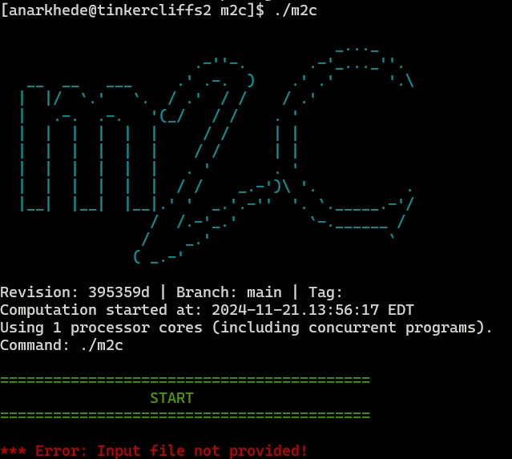
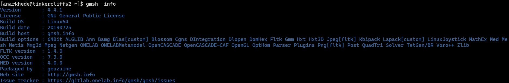
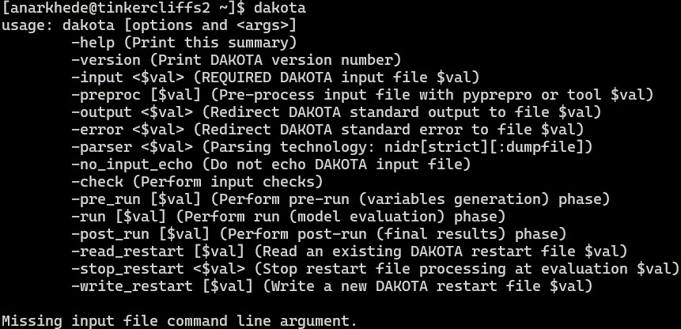

# SOFICS

`SOFICS` (**S**tructural **O**ptimization through **F**luid-structure **I**nteraction and **C**oupled **S**imulations) is a software toolkit that optimizes the design of structures exposed to extreme loads generated by detonations. 

It relies on four key open-source software tools:

* `M2C`: A finite volume-based fluid dynamics solver.
* `Aero-S`: A finite element-based solid dynamics solver.
* `Gmsh`: A generator for meshes.
* `Dakota`: A toolkit for optimization.

`M2C` and `Aero-S` are in-house, open-source solvers developed in C++, while `Gmsh` ([Geuzaine *et al.*](https://doi.org/10.1002/nme.2579)) and `Dakota` ([Adams *et al.*](https://doi.org/10.2172/1817318)) are external open-source tools. `M2C` includes a non-uniform Cartesian mesh generator, allowing users to define the finite-volume mesh for fluid dynamics directly through the `M2C` input file (see examples in the `tests` directory). As a result, `Gmsh` is only needed to create meshes for structural dynamics analysis.

A C++ utility called `gmsh2aeros` is available in the `src` directory. This utility converts finite-element meshes from the `MSH` format (used by `Gmsh`) to the `TOP` format required by `Aero-S`. The utility is built along with `SOFICS`.

`Dakota` is an open-source tool for simulation-based design optimization, chosen for its range of gradient-based and gradient-free optimization methods, along with its robust asynchronous and parallel evaluation capabilities. At its core, `Dakota` employs the operating system's fork interface to create child processes, which handle the execution of the coupled fluid-structure simulations.

In this setup, `Dakota` supplies a file containing the design parameter values to each forked process and expects a file with the relevant function values as output. Since `SOFICS` focuses on optimizing structures under coupled loads, these function values are derived by post-processing the simulation results generated by `Aero-S`.

A C++ utility called `aeros2dakota` is available in the `src` directory. This utility converts the results from `Aero-S` to relevant function values. The utility is built along with `SOFICS`.

# Instructions

`SOFICS` includes local snapshots of `M2C` and `Aero-S`. Instructions for building these versions along with `SOFICS` are provided in the next sections. For the latest releases, you can visit the official repositories: [M2C](https://github.com/kevinwgy/m2c) and [Aero-S](https://bitbucket.org/frg/aero-s/src/master/).

Installation of `Gmsh` and `Dakota` is not handled by `SOFICS`. Instead the user should refer their official repositores [Gmsh](https://gmsh.info/) and [Dakota](https://dakota.sandia.gov/) for build instructions.

***NOTE***: SOFICS does not require or link against a specific version of Gmsh. The software interacts with Gmsh purely through its command-line interface, so any version capable of producing `.msh` files compatible with gmsh2aeros should work. Users are free to install and use whichever Gmsh release best fits their workflow and system environment. For reference and reproducibility, our development and testing were performed using Gmsh version 4.4.1. and Dakota version 6.19

## Default Build

To build `SOFICS`, navigate to the project directory (i.e., the `sofics` directory). A build script is included in this directory, enabling you to install `SOFICS` with the local versions of M2C and Aero-S; follow these steps:

```sh
git submodule update --init --recursive
./build.sh
```

The final command compiles `SOFICS`, `M2C`, and `Aero-S` in parallel using 4 processors (default). You can also adjust the number based on your preference.

All installed binaries are located in `build/sofics/bin`.

For `Aero-S`, first navigate to the build directory and then execute the following commands:
```sh
cd build/sofics/bin
./aeros
```
The output from a successful build should look like,


For `M2C`, again navigate to the build directory and execute the following commands:
```sh
cd build/sofics/bin
./m2c
```
The output from a successful build should look like,



<!--
## Build Without M2C or Aero-S

If `M2C` or `Aero-S` are already installed on your local machine, you can skip compiling the versions provided with `SOFICS`. `SOFICS` provides `BUILD_M2C` and `BUILD_AEROS` variables to specify whether these software tools are built. For example, if you choose not to build M2C, navigate to your `sofics` directory, and then follow these steps:

```sh
```

To check if everything was built correctly perform the checks specified in previous section.
-->

***NOTE:*** When running the optimization, make sure to specify the paths to the relevant executables in a `config.sh` file. This file should be referenced in `Dakota` input file through its `analysis_driver` card. The input for this card should look like:

```text
analysis_driver = 'path/to/sofics/build/src/ --config path/to/config.sh --pre /path/to/prepro.sh --post /path/to/postpro.sh'
```

For detailed instructions and a list of available variables for undertaking optimization studies based on coupled fluid-structure interaction simulations, refer to the example cases available in the `examples` directory.

## Gmsh

We strongly encourage you follow the build instructions provided in the official [Gmsh repository](https://gitlab.onelab.info/gmsh/gmsh/-/tree/gmsh_4_13_1). To verify that the build was successful, try running the following command:

```sh
gmsh -info
```

It should produce an output similar to:



However, keep in mind that the output may vary depending on you `Gmsh` version and build settings.


## Dakota

We strongly encourage you follow the build instructions provided in the official [Dakota repository](https://github.com/snl-dakota/dakota?tab=coc-ov-file). To verify that the build was successful, try running the following command:

```sh
dakota
```

It should display a list of command-line options available in `Dakota`.


