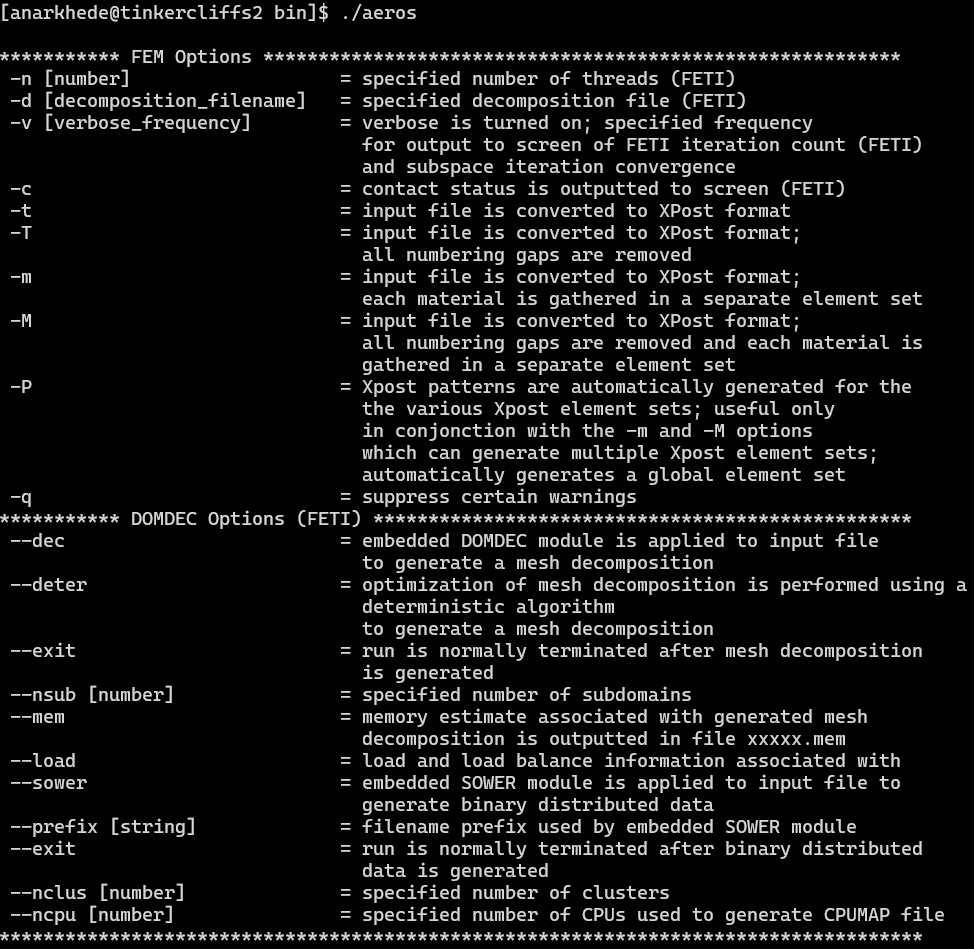
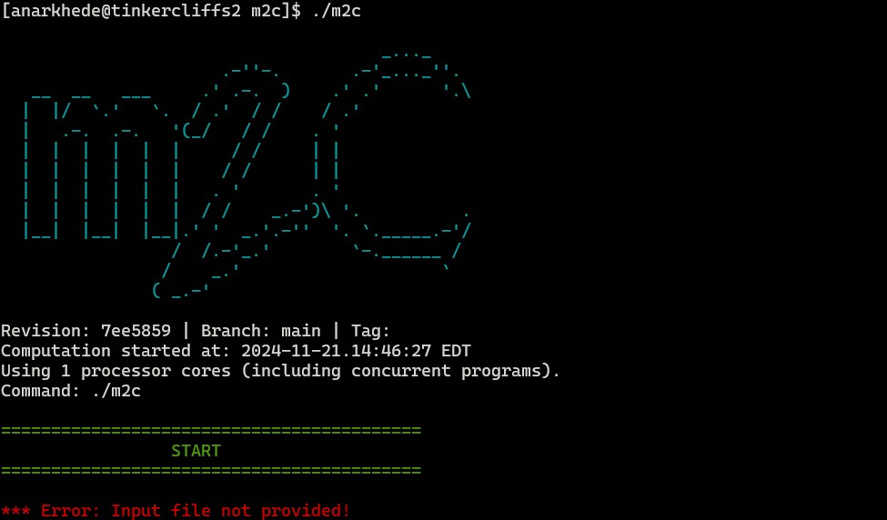

# SOFICS

`SOFICS` (**S**tructural **O**ptimization through **F**luid-structure **I**nteraction and **C**oupled **S**imulations) is a software toolkit that optimizes the design of structures exposed to extreme loads generated by detonations. 

It relies on four key open-source software tools:

* `M2C`: A finite volume-based fluid dynamics solver.
* `Aero-S`: A finite element-based solid dynamics solver.
* `Gmsh`: A generator for meshes.
* `Dakota`: A toolkit for optimization.

`M2C` and `Aero-S` are in-house, open-source solvers developed in C++, while `Gmsh` ([Geuzaine *et al.*](https://doi.org/10.1002/nme.2579)) and `Dakota` ([Adams *et al.*](https://doi.org/10.2172/1817318)) are external open-source tools. `M2C` includes a non-uniform Cartesian mesh generator, allowing users to define the finite-volume mesh for fluid dynamics directly through the `M2C` input file (see examples in the `tests` directory). As a result, `Gmsh` is only needed to create meshes for structural dynamics analysis.

A C++ utility called `gmsh2aeros` is available in the `src` directory. This utility converts finite-element meshes from the `MSH` format (used by `Gmsh`) to the `TOP` format required by `Aero-S`. The utility is built along with `SOFICS`.

`Dakota` is an open-source tool for simulation-based design optimization, chosen for its range of gradient-based and gradient-free optimization methods, along with its robust asynchronous and parallel evaluation capabilities. At its core, `Dakota` employs the operating system's fork interface to create child processes, which handle the execution of the coupled fluid-structure simulations.

In this setup, `Dakota` supplies a file containing the design parameter values to each forked process and expects a file with the relevant function values as output. Since `SOFICS` focuses on optimizing structures under coupled loads, these function values are derived by post-processing the simulation results generated by `Aero-S`.

A C++ utility called `postprocessor` is available in the `src` directory. This utility converts the results from `Aero-S` to relevant function values. The utility is built along with `SOFICS`.

# Instructions

`SOFICS` includes local snapshots of `M2C` and `Aero-S`. Instructions for building these versions along with `SOFICS` are provided in the next sections. For the latest releases, you can visit the official repositories: [M2C](https://github.com/kevinwgy/m2c) and [Aero-S](https://bitbucket.org/frg/aero-s/src/master/).

Installation of `Gmsh` and `Dakota` is not handled by `SOFICS`. Instead the user should refer their official repositores [Gmsh](https://gitlab.onelab.info/gmsh/gmsh/-/tree/gmsh_4_13_1) and [Dakota](https://github.com/snl-dakota/dakota?tab=coc-ov-file) for build instructions.

## Default build

To build `SOFICS`, navigate to the project directory (i.e., the `sofics` directory). A build file is included in this directory, enabling you to install `SOFICS` with the local versions of M2C and Aero-S; follow these steps:

```sh
cmake -B build .
cd build
make -j 4
```

The final make command compiles `SOFICS`, `M2C`, and `Aero-S` in parallel using 4 processors. You can also simply run make without specifying the number of processors or adjust the number based on your preference.

A successfull build should provide `checks.sh`, `driver.sh`, `pre_processor.sh`, and `post_processor.sh` bash scripts along with `gmsh2aeros` and `postprocessor` executables in `build/src`. Moreover, `build/packages` should contain directories `aeros` and `m2c`. To check if build for these solvers was successfull try the following commands.

A successful build should generate the following bash scripts in the `build/src` directory: 
* checks.sh
* driver.sh
* pre_processor.sh
* post_processor.sh

Additionally, it should also contain the executables for `gmsh2aeros` and `postprocessor`. The `build/packages` directory should contain the `aeros` and `m2c` directories. To verify that the build for these solvers was successful, you can try the following solver specific commands.

For `Aero-S`, first navigate to the build directory and then execute the following commands,
```sh
cd packages/aeros/bin
./aeros
```
The output from a successful build should look like,



For `M2C`, again navigate to the build directory and execute the following commands,
```sh
cd packages/m2c/
./m2c
```
The output from a successful build should look like,



## Build without M2C or Aero-S

If you have your own versions of M2C or Aero-S, you can choose to not compile the local snapshots. However, when running the optimization make sure to specify the path to relevant executables in a `config.sh` file and provide it to `Dakota`. For detailed instructions on executing fluid-structure coupled optimization studies refer the test cases provided in `root/tests` directory.

SOFICS provides `BUILD_M2C` and `BUILD_AEROS` variables to specify whether to build these softwares or not. For example if you choose not to build M2C follow

```sh
cmake -B build -DBUILD_M2C=OFF .
cd build
make -j 4
```

To check if everything was built correctly perform the checks specified in previous section.

## GMSH


## Dakota