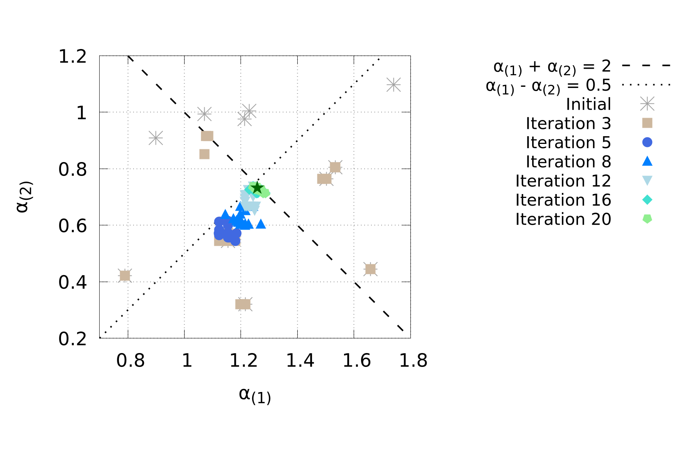
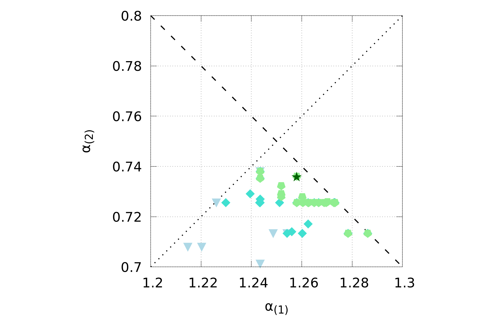

# Optimization of 1-D piston subjected to shock loading

## Piston

A simple spring-mass system solver is provided in this example repository to serve as the structural solver. It is a CMake project and is *not* built by the top-level `SOFICS` build script. This solver depends on `MPI`, `flex`, and `bison` and can be compiled using,

```sh
cd piston
cmake .
make
```

The build places the executable at `piston/piston`, which is the path that `config.sh` assigns to `AEROS_EXE`. If you prefer an out-of-source build, remember to update `AEROS_EXE` accordingly.

The fluid solver used to capture the complex shock dynamics and fluid-structure interfactions for this problem is set to M2C.

## Dakota Setup

Asynchronous evaluations are spwaned using `Dakota`'s `fork` application interface, with the required setup specified in `dakota.in` input file. The `fork` interface requires an `analysis_driver` that reads the provided desgin parameters, performs the neccessary evaluations, and outputs the response functions. In `SOFICS`, the `driver.sh` bash script located in your `build` directory serves as the `analysis_dirver`. This script requires user-defined setup details, including input files for `Gmsh`, `M2C`, and `Aero-S`, as well as resource specifications for each evaluation. The setup details can be specified in a conguration file, where as the finite element mesh setup can be specified in a custom pre-processor script. Collectively, these scripts can be passed to the driver through command line arguments, like the ones shown in `dakota.in`. 

## Local Evaluation

To launch the simulation use `Dakota's` command line interface, i.e.,

```sh
dakota -i dakota.in -o dakota.log -w dakota.rst
```

Here, `dakota.in` is our input file, `dakota.log` is the log file to which Dakota's output will be written, and `dakota.rst` is a restart file.

## Cluster Evaluation

An example `SLURM` configuration can be found in the `run.sh` file, which can employed to launch a `Dakota` process on Virginia Tech's `Tinkercliffs` compute cluster. Update the following lines to match your preference and account details.

```sh
#SBATCH --job-name=dakota           # Job name
#SBATCH --partition=normal_q        # Partition or queue name
#SBATCH --account=m2clab            # Cluster account
```

The script uses the `dakota` command to call your `Dakota` installation, so ensure `Dakota` is properly installed before submitting a job. Follow the installation instructions available on the official [Dakota repository](https://github.com/snl-dakota/dakota?tab=coc-ov-file).

***Note:*** Ensure that sufficient compute nodes are allocated to the job. In this demonstration, each simulation requires 4 computational cores (CPUs): 3 for the fluid solver and 1 for the structural solver. Therefore, the total number of cores needed will be `4 × evaluation concurrency`. Since each node on `Tinkercliffs` consists of 128 CPUs, you should adjust your resource allocation accordingly. Update the following line in `run.sh` to specify your resource requirements:

```sh
#SBATCH --nodes=1                   # Number of nodes
#SBATCH --ntasks-per-node=126       # Number of tasks per node
```

To submit a job on the compute cluster, use:

```sh
sbatch run.sh
```

To verify that the job was successfully submitted, run:

```sh
squeue | grep "your-user-id"
```

This command will display a list of jobs currently running under your user ID on the cluster.

## Results

The design variables $\alpha_{(1)}$ and $\alpha_{(2)}$ are non-dimensional scale factors applied to the two springs of the spring-mass system. The pre-processor (`pre_pro.sh`) combines them in series into an equivalent stiffness and an equivalent mass,

$$
k_{eq} = 10^{5} \left(\frac{1}{\alpha_{(1)}} + \frac{1}{\alpha_{(2)}}\right)^{-1},
\qquad
m_{eq} = 10^{-3}\left(\alpha_{(1)} + \alpha_{(2)}\right),
$$

which are substituted into the structural solver's input file. Units throughout are grams, millimetres and seconds.

The optimizer minimizes the peak velocity of the piston, sampled at probe node 0, subject to an upper limit on its peak displacement:

$$
\min_{\alpha} \; \max_{t} \left| \dot{u} \right|
\qquad \text{subject to} \qquad
\max_{t} \left| u \right| \leq 10 \text{ mm},
$$

together with the two linear constraints $\alpha_{(1)} + \alpha_{(2)} \leq 2$ and $\alpha_{(1)} - \alpha_{(2)} \geq 0.5$ declared in `dakota.in`.

The study was run with a population of 20 over 20 generations, which took 407 coupled fluid-structure evaluations. The figure below shows the populations at selected generations in the design space. The dashed and dotted lines are the two linear constraints, and the star marks the final design.



Successive generations collapse onto the intersection of the two linear constraints. A magnified view of the final generations is shown below.



The best design was found at evaluation 393:

$$
\begin{aligned}
\alpha_{(1)} &= 1.2579603516 \\
\alpha_{(2)} &= 0.7360596065
\end{aligned}
$$

which compares well with the analytical optimum of $\alpha_{(1)} = 1.25$, $\alpha_{(2)} = 0.75$.

`Dakota` writes the full history to `dakota_tabular.dat` and the per-generation populations to `population_*.dat`, and reports the best design at the end of `dakota.log`:

```sh
grep "Best parameters" dakota.log
```
