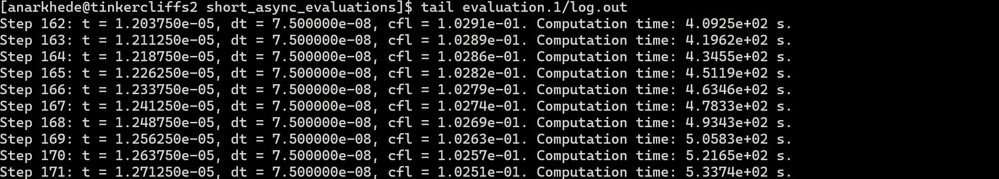

# Short Ansychronous Evaluation Case

This example case demonstrates the simulation setup required for successful evaluation of two structural design configurations using coupled fluid-structure interaction simulations. The provided `config.sh` is sized for a workstation, allocating 4 computational cores to each simulation. 

We consider an ellipsoidal containment structure which is subjected to an internal TNT explosion. The major and minor radii of the containment structure serve as the variable parameters in the two evaluations. The geometry of the containment structure is defined in the `templates/struct.geo.template` file using `Gmsh`'s dedicated `.geo` language. In this template, placeholders like `{cdv_1}` and `{cdv_2}` represent the major and minor radii values. `SOFICS` automatically replaces these placeholders with the appropriate values from the parameter file generated by `Dakota`.

The generic Aero-S and M2C simulation setups are defined in the `templates/fem.in.template` and `templates/input.st.template`, respectively. The non-linear detonation-induced pressure, density, and velocity profile is provided in the `templates/SphericalShock.txt` which serves as an input for `M2C`.

<!-- ## Structural simualtion setup -->

<!-- ## Fluid simulation setup -->

## Dakota Setup

Asynchronous evaluations are spwaned using `Dakota`'s `fork` application interface, with the required setup specified in `dakota.in` input file. The `fork` interface requires an `analysis_driver` that reads the provided desgin parameters, performs the neccessary evaluations, and outputs the response functions. In `SOFICS`, the `driver.sh` bash script located in your `build` directory serves as the `analysis_dirver`. This script requires user-defined setup details, including input files for `Gmsh`, `M2C`, and `Aero-S`, as well as resource specifications for each evaluation. These details are supplied to `driver.sh` via a configuration file, similar to the example `config.sh` provided. The required parameters to be defined in this configuration file are listed below.

* Fluid simulation setup
    * ***M2C_INPUT***: Should be set to the name of the `M2C` input file that contains the configuration for the fluid simulation. The file must contain `under ConcurrentPrograms { under AeroS { FSIAlgorithm = ByAeroS; }}` which instructs `M2C` to treat the simulation as a coupled fluid-structure interaction simulation.
    * ***M2C_AUX***: Should be a colon-delimited list of additional files required by `M2C` for the fluid simulation, e.g., `file1:file2:file3`.
    * ***M2C_EXE***: Should be set to the path of your personal `M2C` executable. By default, `SOFICS` uses the locally packaged version of `M2C` if available; otherwise, an error will be raised.
    * ***M2C_SIZE***: Should be set to the number of computational cores allocated to `M2C` for each coupled fluid-structure interaction simulation.
* Structural simulation setup
    * ***AEROS_INPUT***: Should be set to the name of the `Aero-S` input file that contains the configuration for the structural simulation. The file must contain `EMBEDDED #` card, where `#` is replaced with the surface ID of the embedded or the wetted surface as defined in the `Gmsh` input file. This card instructs `Aero-S` to treat the simulation as a coupled fluid-structure interaction simulation.
    * ***AEROS_EXE***: Should be set to the path of your personal `Aero-S` executable. By default, `SOFICS` uses the locally packaged version of `Aero-S` if available; otherwise, an error will be raised.
    * ***AEROS_SIZE***: Should be set to the number of computational cores allocated to `Aero-S` for each coupled fluid-structure interaction simulation.
* Finite-element meshing setup
    * ***GMSH_INPUT***: Should be set to the name of the `Gmsh` input file that defines the procedure for building and meshing the structural geometry. The continuous design variables provided by `Dakota` can be used in this file by wrapping the variable name in `{}`. `SOFICS` uses the default variable names, where continuous design variables follow the pattern `cdv_i`, and continuous state variables follow `csv_i`.
    * ***GMSH_EXE***: Should be set to the path of your personal `Gmsh` executable. If `Gmsh` is installed correctly, this variable can simply be `GMSH_EXE=gmsh`.
* Miscellaneous
    * ***TEMPLATE_DIR***: Should be the name of the directory where you store all the input file templates, if you choose to organize them in one location. By default, `SOFICS` uses the directory from which the `Dakota` job is launched.
    * ***EVALUATION_CONCURRENCY***: Should reflect the evaluation concurrency specified in the `Dakota` input file.

## Local Evaluation

Each coupled fluid-structure simulation is allocated 4 computational cores (`M2C_SIZE=3` and `AEROS_SIZE=1`), and `dakota.in` requests `evaluation_concurrency = 1`, so the two designs are evaluated one after the other. Ensure that `gmsh` and `dakota` are available on your `PATH`, and then launch the study using `Dakota's` command line interface, i.e.,

```sh
dakota -i dakota.in -o dakota.log -w dakota.rst
```

`Dakota` creates an `evaluation.1` and an `evaluation.2` directory, one for each design. To follow the coupled simulation for the design currently being evaluated, use:

```sh
tail -f evaluation.1/log.out
```

## Cluster Evaluation

To scale the study up for a compute cluster, increase `M2C_SIZE` and `AEROS_SIZE` in `config.sh` to increase the number of compute utilization. You can also increase the `evaluation_concurrency` in `dakota.in` to the number of designs you wish to evaluate concurrently, to speed-up the optimization. The `SLURM` allocation in `run.sh` should be sized accordingly.

An example `SLURM` configuration can be found in the `run.sh` file, which can employed to launch a `Dakota` process on Virginia Tech's `Tinkercliffs` compute cluster. Update the following lines to match your preference and account details.
```sh
#SBATCH --job-name=dakota           # Job name
#SBATCH --partition=normal_q        # Partition or queue name
#SBATCH --account=m2clab            # Cluster account
```

The script uses the `dakota` command to call your `Dakota` installation, so ensure `Dakota` is properly installed before submitting a job. Follow the installation instructions available on the official [Dakota repository](https://github.com/snl-dakota/dakota?tab=coc-ov-file).

***Note:*** In this example script, each simulation requires 64 computational cores (`M2C_SIZE=56` and `AEROS_SIZE=8`). Therefore, the total number of cores needed will be `64 × evaluation concurrency`. Since each node on `Tinkercliffs` consists of 128 CPUs, you should adjust your resource allocation accordingly. Update the following line in `run.sh` to specify your resource requirements:

To submit a job on the compute cluster, use:

```sh
sbatch run.sh
```

To verify that the job was successfully submitted, run:

```sh
squeue | grep "your-user-id"
```

This command will display a list of jobs currently running under your user ID on the cluster.

## Expectation

The test case is designed to run for 10 minutes, and will terminate the coupled fluid-structure interaction evaluations abruptly. It is specifically tailored to demonstrate the required inputs and the procedure for submitting a `Dakota` job to the compute cluster. Upon completion, your directory should contain two new subdirectories along with log files generated by `Dakota`. 

To confirm that `Dakota` successfully spwaned the coupled fluid-structure interaction processes, use:

```sh
grep "Evaluation" srun.out
```

This command will display the evaluation IDs along with the compute node IDs where each evaluation was executed. These should align with the node assigned to the `Dakota` job (refer the `squeue` command output), as shown in the example below:


To verify the coupled fluid-structure interaction processes launched correctly, use:

```sh
tail evaluation.1/log.out
```

The command output from a successful execution should resemble,



## Results

This case is a `list_parameter_study` over the two design points declared in `dakota.in`, $(l_x, l_y) = (280, 225)$ and $(170, 270)$, and not an optimization. For each point `Dakota` records two response functions, obtained by the default post-processor `post_processor.sh` through `aeros2dakota`: the mass of the containment structure, read from `results/mass.out`, and the maximum effective plastic strain developed in the structure, read from `results/epstrain`.

Because the job is deliberately terminated after 10 minutes, the coupled simulations do not reach their final time and the recorded response values are those accumulated up to the point of termination. They are therefore not physically meaningful, and are useful only for confirming that the evaluations ran and were post-processed.

The values collected for both designs are written to the tabular data file:

```sh
cat dakota.dat
```
