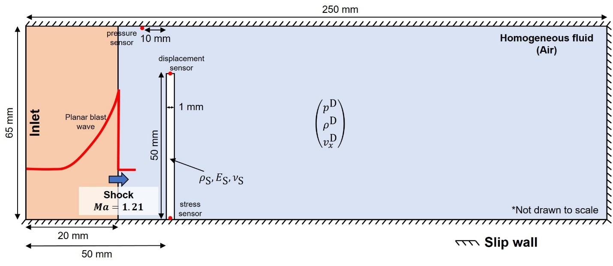
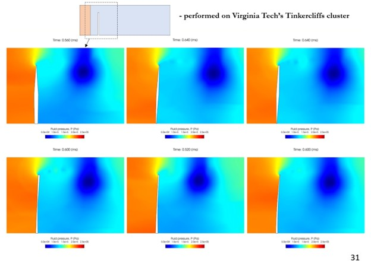
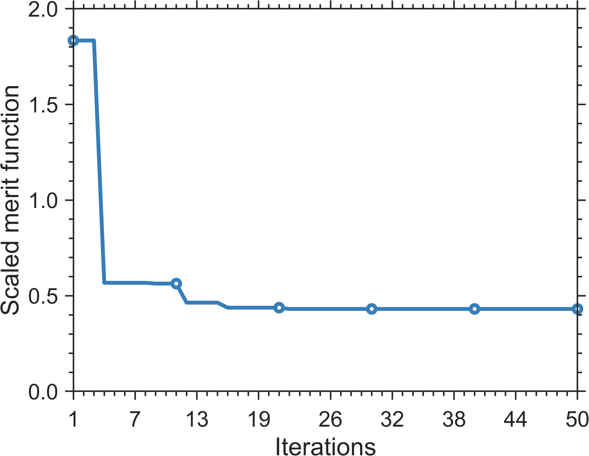

# Full Genetic Optimization of cantilever panel subjected to repeated shock loading

The problem setup is shown below.



## Dakota Setup

Asynchronous evaluations are spwaned using `Dakota`'s `fork` application interface, with the required setup specified in `dakota.in` input file. The `fork` interface requires an `analysis_driver` that reads the provided desgin parameters, performs the neccessary evaluations, and outputs the response functions. In `SOFICS`, the `driver.sh` bash script located in your `build` directory serves as the `analysis_dirver`. This script requires user-defined setup details, including input files for `Gmsh`, `M2C`, and `Aero-S`, as well as resource specifications for each evaluation. The setup details can be specified in a conguration file, where as the finite element mesh setup can be specified in a custom pre-processor script. Collectively, these scripts can be passed to the driver through command line arguments, like the ones shown in `dakota.in`. 

## Local Evaluation

The provided `config.sh` is sized for a single workstation. Each coupled fluid-structure simulation is allocated 4 computational cores (`M2C_SIZE=3` and `AEROS_SIZE=1`), and `dakota.in` requests `evaluation_concurrency = 1`, so at most 4 MPI processes run at any time. Ensure that `gmsh` and `dakota` are available on your `PATH`, and then launch the study using `Dakota's` command line interface, i.e.,

```sh
dakota -i dakota.in -o dakota.log -w dakota.rst
```

`Dakota` creates an `evaluation.N` directory for each design it evaluates. To follow the coupled simulation for the design currently being evaluated, use:

```sh
tail -f evaluation.1/log.out
```

***Note:*** The fluid mesh and the simulation setup are identical to the ones used on the compute cluster, so a single evaluation takes considerably longer here than it does on 64 cores. The local setup is meant for verifying that the toolchain is configured correctly. You can interrupt `Dakota` once the first few evaluations have completed.

## Cluster Evaluation (Recommended)

To scale the study up for a compute cluster, set `M2C_SIZE=63` in `config.sh`, which allocates 64 computational cores to each simulation, and raise `evaluation_concurrency` in `dakota.in` to the number of designs you wish to evaluate concurrently. The `SLURM` allocation in `run.sh` should be sized accordingly.

The `SLURM` scheduller is employed to launch the `Dakota` process on Virginia Tech's `Tinkercliffs` compute cluster. An example `SLURM` configuration can be found in the `run.sh` file. Update the following lines to match your preference and account details:

```sh
#SBATCH --job-name=dakota           # Job name
#SBATCH --partition=normal_q        # Partition or queue name
#SBATCH --account=m2clab            # Cluster account
```

The script uses the `dakota` command to call your `Dakota` installation, so ensure `Dakota` is properly installed before submitting a job. Follow the installation instructions available on the official [Dakota repository](https://github.com/snl-dakota/dakota?tab=coc-ov-file).

***Note:*** Ensure that sufficient compute nodes are allocated to the job. In this demonstration, each simulation requires 64 computational cores (CPUs). Therefore, the total number of cores needed will be `64 × evaluation concurrency`. Since each node on `Tinkercliffs` consists of 128 CPUs, you should adjust your resource allocation accordingly. Update the following line in `run.sh` to specify your resource requirements:

```sh
#SBATCH --nodes=4                   # Number of nodes
#SBATCH --ntasks-per-node=128       # Number of tasks per node
```

To submit a job on the compute cluster, use:

```sh
sbatch run.sh
```

To verify that the job was successfully submitted, run:

```sh
squeue | grep "your-user-id"
```

This command will display a list of jobs currently running under your user ID on the cluster.

## Results

The full optimization was undertaken on Virginia Tech's Tinkercliffs computing cluster.
The figure below depicts six example designs explored by the optimizer.



The optimizer minimizes a merit function defined as:

$$
\text{merit} = \text{objective} + \text{penalty} \cdot \max\left(\mathbf{0},\ \text{constraints}\right)
$$

The corresponding merit function history over 50 iterations is shown below:



The final optimized design parameters are:

$$
\begin{aligned}
t_1 &= 0.422315373841 \\
t_2 &= 0.972684923009 \\
t_3 &= 1.62662958746
\end{aligned}
$$
