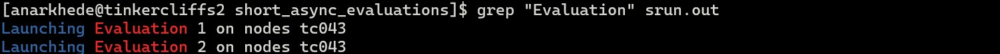
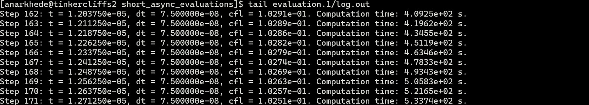

# Short Ansychronous evaluation case

This example case demonstrates the simulation setup required for successful evaluation of two structural design configurations using coupled fluid-structure interaction simulations. Each simulation in this case utilizes 64 computational cores: 56 for the fluid solver and 8 for the structural solver. Simulations will be executed asynchronously on a single compute node, through the `SLURM` scheduling directive.

We consider an ellipsoidal containment structure which is subjected to an internal TNT explosion. The major and minor radii of the containment structure serve as the variable parameters in the two evaluations. The geometry of the containment structure is defined in the `templates/struct.geo.template` file using `Gmsh`'s dedicated `.geo` language. In this template, placeholders like `{cdv_1}` and `{cdv_2}` represent the major and minor radii values. `SOFICS` automatically replaces these placeholders with the appropriate values from the parameter file generated by `Dakota`.

The generic Aero-S and M2C simulation setups are defined in the `templates/fem.in.template` and `templates/input.st.template`, respectively. The non-linear detonation-induced pressure, density, and velocity profile is provided in the `templates/SphericalShock.txt.template` which serves as an input for `M2C`.

<!-- ## Structural simualtion setup -->

<!-- ## Fluid simulation setup -->

## Dakota setup

Asynchronous evaluations are spwaned using `Dakota`'s `fork` application interface, with the required setup specified in `dakota.in` input file. The `fork` interface requires an `analysis_driver` that reads the provided desgin parameters, performs the neccessary evaluations, and outputs the response functions. In `SOFICS`, the `driver.sh` bash script located in your `build` directory serves as the `analysis_dirver`. This script requires user-defined setup details, including input files for `Gmsh`, `M2C`, and `Aero-S`, as well as resource specifications for each evaluation. These details are supplied to `driver.sh` via a configuration file, similar to the example `myconfig.sh` provided. The required parameters to be defined in this configuration file are listed below.

* Fluid simulation setup
    * ***M2C_INPUT***:
    * ***M2C_AUX***:
    * ***M2C_EXE***:
    * ***M2C_SIZE***:
* Structural simulation setup
    * ***AEROS_INPUT***:
    * ***AEROS_EXE***:
    * ***AEROS_SIZE***:
* Finite-element meshing setup
    * ***GMSH_INPUT***:
    * ***GMSH_EXE***:
* Miscellaneous
    * ***TEMPLATE_DIR***:
    * ***EVALUATION_CONCURRENCY***:

## Evaluation

The `SLURM` scheduller is employed to launch the `Dakota` process on Virginia Tech's `Tinkercliffs` compute cluster. An example `SLURM` configuration can be found in the `run.sh` file. Update the following lines to match your preference and account details:

```sh
#SBATCH --job-name=dakota           # Job name
#SBATCH --partition=normal_q        # Partition or queue name
#SBATCH --account=m2clab            # Cluster account
```

The script uses the `dakota` command to call your `Dakota` installation, so ensure `Dakota` is properly installed before submitting a job. Follow the installation instructions available on the official [Dakota repository](https://github.com/snl-dakota/dakota?tab=coc-ov-file).

To submit a job on the compute cluster, use:

```sh
sbatch run.sh
```

To verify that the job was successfully submitted, run:

```sh
squeue | grep "your-user-id"
```

This command will display a list of jobs currently running under your user ID on the cluster.

## Expectations

The test case is designed to run for 10 minutes, and will terminate the coupled fluid-structure interaction evaluations abruptly. It is specifically tailored to demonstrate the required inputs and the procedure for submitting a `Dakota` job to the compute cluster. Upon completion, your directory should contain two new subdirectories along with log files generated by `Dakota`. 

To confirm that `Dakota` successfully spwaned the coupled fluid-structure interaction processes, use:

```sh
grep "Evaluation" srun.out
```

This command will display the evaluation IDs along with the compute node IDs where each evaluation was executed. These should align with the node assigned to the `Dakota` job (refer the `squeue` command output), as shown in the example below:



To verify the coupled fluid-structure interaction processes launched correctly, use:

```sh
tail evaluation.1/log.out
```

The command output from a successful execution should look like,

