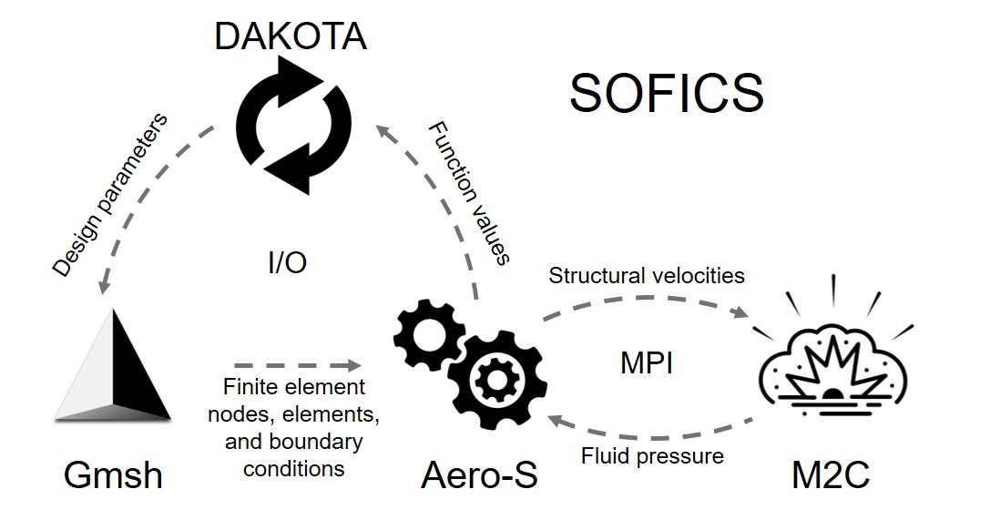
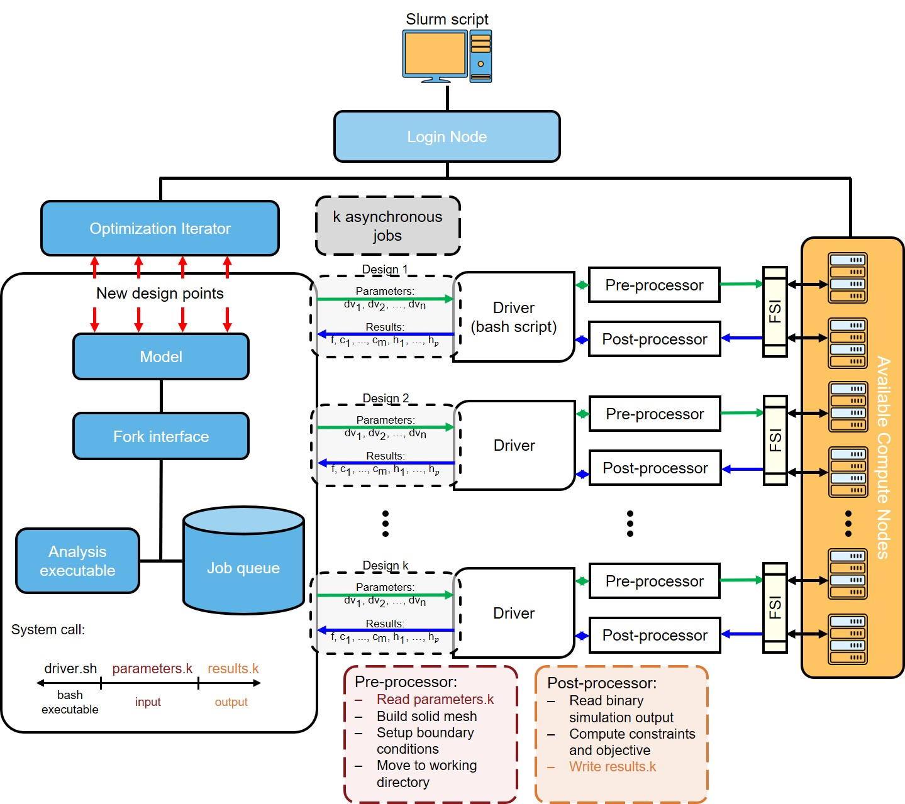

# Summary
`SOFICS` (**S**tructural **O**timization through **F**luid-structure **I**nteraction and **C**oupled **S**imulations) is a software toolkit that optimizes the design of structures exposed to extreme loads generated by detonations. It combines the open-source fluid solver M2C and structural solver Aero-S to model the coupled fluid behavior and structural responses, and integrates with Dakota, an open-source optimization tool to explore various design options efficiently. By reusing a fixed simulation setup for the fluid simulations for different design variations, `SOFICS` reduces computational costs while maintaining accuracy. `SOFICS` simplifies and streamlines the complex task of designing impact-resistant structures, making it accessible to a broad range of users.

# Statement of need

Designing structures to withstand detonation-induced loads involves several key challenges. Detonations generate high fluid density, velocity, and pressure in the surrounding fluid medium. When the structure is impacted by such fluid flows, it can undergo large, permanent deformations that affect the dynamics of the surrounding fluid flow. This could further alter the dynamics of the structure, resulting in a two-way interaction between the fluid flow and the structural response. The boundary shared by the fluid and structural domains, the fluid-structure interface, evolves in space and time. Consequently, the finite volume mesh used for fluid flow computations must be able deform and move according the motion of the shared boundary.

Few open-source solutions exist that can simulate the highly non-linear behavior of detonations and perform coupled fluid-structure simulations to evaluate the response of impacted structures. One possible approach involves coupling open-source finite volume solvers like OpenFOAM [@weller_tensorial_1988] with finite element solvers such as FEniCS[@alnaes_fenics_2015] through a coupling library like preCICE[@chourdakis_precice_2022], which facilitates the transfer of structural velocities, fluid pressures, and shared fluid-structure interfaces between the two independent solvers. However, such a framework typically requires a moving, body-conforming fluid mesh to accurately communicate between solvers, resulting in the need for a unique fluid mesh for each design configuration. Additionally, optimization studies can introduce designs with complex features, such as sharp edges, narrow regions, and discontinuous geometry, which can lead to poor mesh quality and increased computational complexity.

We develop `SOFICS`[^1], shown in Figure \autoref{fig:sopics}, which streamlines the optimization of structures under detonation-induced fluid flows, providing a robust and flexible toolkit for researchers and engineers in the field. It is a utility written in Bash, that loosely-couples an optimizer and a simulation based evaluator that performs coupled fluid-structure simulations and computes the required objective and constraint values. It uses an in-house open-source fluid dynamics solver, M2C[^2], developed in modern C++ with an Object-Oriented programming design. M2C solves the compressible, inviscid Navier-Stokes equations using a high-resolution finite volume method. It supports a range of equations of state including, perfect gas, stiffened gas, and the Jones-Wilkins-Lee equation, which are widely used for simulating detonations in both air and underwater environments.

[^1]: https://github.com/anarkh97/sofics
[^2]: https://github.com/kevinwgy/m2c
[^3]: https://github.com/anarkh97/aero-s-foam

The advantages of using M2C for design optimization are three-fold. First, M2C is directly coupled with our open-source, finite element-based structural dynamics solver Aero-S[^3] using the partitioned procedure[@farhat_robust_2010]. Both solvers are designed for parallel computations, utilizing the Message Passing Interface (MPI) for efficient distributed processing. Second, we use the embedded boundary method~\cite[@ma_computational_2022;@wang_computational_2012;@wang_computational_2015] to accommodate large deflections. The method tracks the fluid-structure interface explicitly within a fixed, non-uniform, non-body conforming finite volume mesh, eliminating the need for mesh motion and frequent re-meshing. As a result, a single, fixed fluid mesh can be computed *a priori* and used consistently across different design configurations. Finally, M2C computes the interfacial mass, momentum, and energy fluxes across the fluid-structure interface using the FInite Volume method with Exact multi-material Riemann problems (FIVER), which solves a 1D fluid-structure Riemann problem locally featuring a constant interface velocity obtained from the structural solver[@ma_computational_2022;@wang_computational_2012]. The coupled fluid-structure simulation model has been validated for several multiphase flow and fluid-structure interaction problems. These include underwater explosions and implosions [@farhat_dynamic_2013;@ma_computational_2022], cavitation [@cao_shock_2021;@zhao_long_2023], hypervelocity impacts [@islam_fluid_2023;@islam_plasma_2023], and shockwave and laser lithotripsy [@cao_shock_2019;@wang_multiphase_2017;@zhao_simulating_2023].

`SOFICS` utilizes the open-source software Dakota [@adams_dakota_2022] for simulation-based design optimization. Dakota was chosen because it provides a range of gradient-based and gradient-free optimization methods, along with robust asynchronous and parallel evaluation capabilities. It treats the fluid-structure simulation as a "black-box," using a user-defined `analysis_driver` -- which can be an executable or a script -- to generate a short results file containing the necessary objective and constraint values. It employs the operating system's fork interface to spawn child processes, on which the coupled fluid-structure simulations are executed. 

To simplify usage, the analysis_driver is divided into three Bash scripts: `pre_processor.sh`, `driver.sh`, and `post_processor.sh`. The user can modify the pre- and post-processing scripts to fit their specific requirements. The driver script handles the execution of simulations across distributed processors.  To prevent resource conflicts between concurrent design simulations, it dynamically identifies and allocates "idle" resources based on the evaluation ID assigned by Dakota and the computational requirements for each design evaluation. Figure \autoref{fig:framework} depicts the workflow for a generic optimization scheme in Dakota.

# Acknowledgements

XXX

# References